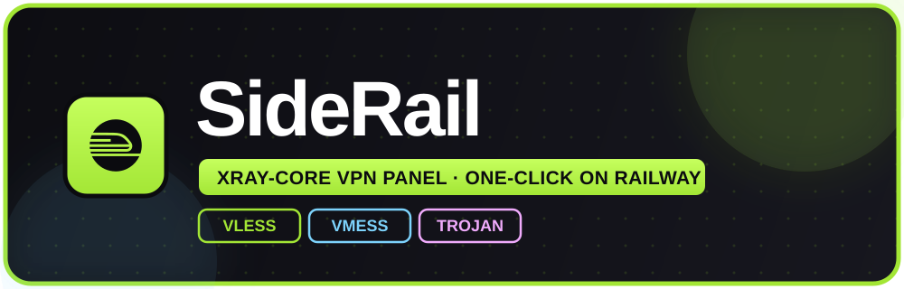

<div align="center">



<br/>
<br/>

<a href="https://railway.com/new">
  
</a>

<br/>
<br/>

<p>
  <a href="LICENSE"></a>
  &nbsp;
  <a href="https://github.com/XTLS/Xray-core"></a>
  &nbsp;
  <a href="https://www.typescriptlang.org"></a>
  &nbsp;
  <a href="https://react.dev"></a>
</p>
<p>
  
  &nbsp;
  
</p>

<br/>
<br/>

**A bold, neobrutalist VPN control panel — powered by&nbsp;<a href="https://github.com/XTLS/Xray-core"></a>&nbsp;and shipped to&nbsp;<a href="https://railway.app"></a>&nbsp;in one click.**

*Clean client links. Live stats. Gorgeous subscription pages. No config, no fuss.*

</div>

<br/>

> [!TIP]
> **Fork → Deploy on Railway → Expose port `8080` → Open the panel.** Four steps, zero config, live in minutes.

<br/>


<table>
<tr>
<td width="50%" valign="top">

**One job, done right**

No feature bloat. HVPN masters **HTTP-based transports behind a TLS edge** — every link is clean, standard, and always `security=tls` on port `443`.

</td>
<td width="50%" valign="top">

**Impossible to ignore**

A loud **neobrutalist** UI — thick borders, hard shadows, animated icons — that looks razor-sharp on phone and desktop alike.

</td>
</tr>
<tr>
<td width="50%" valign="top">

**Deploy and forget**

Xray-core pulls itself on first boot, the session secret is generated for you, and the DB just works. **Zero environment variables required.**

</td>
<td width="50%" valign="top">

**Team-friendly**

The Owner adds Admins with scoped page access and personal data quotas — and every Admin only ever sees the users they created.

</td>
</tr>
</table>

<br/>


<table>
<tr>
<td valign="top"><b>Dashboard</b></td>
<td>Live CPU, RAM, Swap and Storage metrics, plus one-click Backup &amp; Restore of users, inbounds, admins and settings.</td>
</tr>
<tr>
<td valign="top"><b>Users</b></td>
<td>Rich create form, summary cards, a fully responsive table, live <b>Connected IPs</b>, and per-user actions.</td>
</tr>
<tr>
<td valign="top"><b>Inbounds</b></td>
<td>Five HTTP inbounds auto-seeded on first boot. Enable or disable only, each with a unique port and <code>/HVPN/...</code> path.</td>
</tr>
<tr>
<td valign="top"><b>Activity Log</b></td>
<td>A live timeline of every administrative event.</td>
</tr>
<tr>
<td valign="top"><b>Settings &amp; Admins</b></td>
<td>Owner and Admin roles, scoped permissions, and per-admin data quotas.</td>
</tr>
<tr>
<td valign="top"><b>Subscription</b></td>
<td>A gorgeous per-user page with a live usage chart, QR codes and a base64 subscription for clients.</td>
</tr>
<tr>
<td valign="top"><b>Security</b></td>
<td>JWT sessions, built-in rate limiting, and sniffing fully disabled to prevent the QUIC crash.</td>
</tr>
</table>

<br/>


**No code required. Just follow these steps:**

**1. Fork this repository** — click **Fork** at the top-right to copy it to your GitHub account.

**2. Create a Railway project** — head to&nbsp;<a href="https://railway.app"></a>, then **New Project → Deploy from GitHub repo**, and pick your fork.

**3. Deploy** — Railway reads the `Dockerfile` and `railway.json` and builds automatically.

**4. Expose port `8080`** — open **Settings → Networking → Generate Domain**, and set the port to **`8080`**.

> [!IMPORTANT]
> HVPN listens on port **`8080`** — this is the **only** port you expose. The ports `10085` and `20000–20004` are Xray's internal ports bound to `127.0.0.1`; they are private and must **not** be exposed.

**5. Add a volume (optional)** — attach a **Volume** at **`/data`** so users, admins and settings survive redeploys.

**6. Open your panel** — visit the generated `*.up.railway.app` domain, land on the **Setup** page, and create your **Owner** account.

<br/>


**All optional.**

| Variable | Default | Description |
|:--|:--|:--|
| `PORT` | `8080` | HTTP port. **Expose this one on Railway.** |
| `JWT_SECRET` | *auto* | Signs admin session cookies. Auto-generated and persisted if unset. |
| `XRAY_VERSION` | `v26.9.9` | Xray-core release fetched on first boot. |
| `HVPN_DATA_DIR` | `/data` | Persistent data directory (mount a volume here). |
| `PUBLIC_DOMAIN` | *auto* | Override for a custom domain. Falls back to `RAILWAY_PUBLIC_DOMAIN`. |
| `XRAY_API_PORT` | `10085` | Internal Xray stats API port. |
| `XRAY_INBOUND_BASE_PORT` | `20000` | Base port for internal inbound listeners. |

<br/>


```
apps/
├─ web/           React + Vite + Tailwind (neobrutalism) frontend
│  └─ src/
│     ├─ components/ui/   Reusable neobrutalist primitives
│     ├─ pages/           Dashboard · Users · Inbounds · Activity · Settings · Setup · Login · Subscription
│     └─ lib/             API client, auth context, helpers
└─ server/        Express + Node (node:sqlite) backend
   └─ src/
      ├─ xray.ts          Binary fetch, process manager, traffic stats, client IPs
      ├─ xray-config.ts   Config builder (sniffing fully disabled)
      ├─ tunnel.ts        WS/HTTPUpgrade via net.Socket, XHTTP via http-proxy
      ├─ links.ts         VLESS/VMess/Trojan link generation
      ├─ inbounds.ts      Default inbound seeding + enable/disable
      ├─ users.ts         User model, traffic reset, sub-token logic
      ├─ auth.ts          Owner/Admin roles, permissions, sessions
      ├─ ratelimit.ts     Rate limiting / brute-force protection
      └─ routes.ts        Authenticated REST API
```

**How traffic flows** — TLS is terminated at the Railway edge; all client links use `security=tls` on port `443`. The Node process routes **WebSocket/HTTPUpgrade** to Xray via raw `net.Socket`, and **XHTTP** through an HTTP proxy. Only `ws`, `httpupgrade` and `xhttp` are supported — raw TCP, gRPC, WireGuard and Hysteria are intentionally left out because they don't survive the edge.

<br/>


**Requires Node.js ≥ 22.5 (Node 24 recommended).**

```bash
npm install     # install all workspaces
npm run dev     # web on :5173, server on :8080 (proxied)

npm run build   # production build (web + server)
npm start       # serve API + built frontend on :8080
```

<br/>


<a href="https://www.star-history.com/#Hohoseini/HVPN&Date">
  <picture>
    <source media="(prefers-color-scheme: dark)" srcset="https://api.star-history.com/chart?repos=Hohoseini/HVPN&type=Date&theme=dark" />
    <source media="(prefers-color-scheme: light)" srcset="https://api.star-history.com/chart?repos=Hohoseini/HVPN&type=Date" />
    
  </picture>
</a>

<br/>
<br/>

<br/>


**HVPN is proprietary software. © 2025 Hohoseini — all rights reserved.**

It is published for transparency and personal self-hosting only. You are welcome to fork and run your own instance, but the following are **strictly prohibited** without prior written permission:

- Selling, reselling, or offering HVPN (or any derivative) as a paid product or service.
- White-labeling or re-branding it under another name.
- Removing or altering the **Hohoseini / HVPN** attribution, branding, logos, repository links, or the embedded authorship watermarks.
- Claiming authorship of the project.

The source code carries embedded authorship identifiers and watermarks used to prove origin.

<a href="LICENSE"></a>

<br/>

<div align="center">

<a href="LICENSE"></a>

</div>
